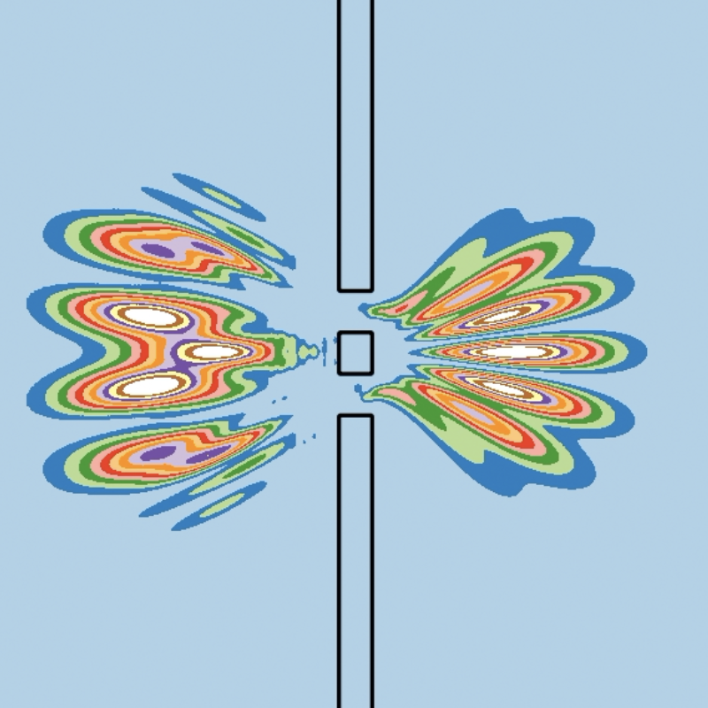

# UCAlab: Unitary Cellular Automata lab

## Background

* *Experiments with Schr\"odinger Cellular Automata*,
  Kees van Berkel, Jan de Graaf, and Kees van Hee,
  **arXiv** quant-ph 2406.08586 (soon to be updated).

**Abstract:**

> We derive a class of cellular automata for the Schr\"odinger Hamiltonian,
including scalar and vector potentials.
It is based on a multi-split of the Hamiltonian,
resulting in a multi-step unitary evolution operator in discrete time and space.
Experiments with one-dimensional automata offer quantitative insight
in phase and group velocities, energy levels, related approximation errors,
and the evolution of a time-dependent harmonic oscilator.
The apparent effects of spatial waveform aliasing are intriguing.
Interference experiments with two-dimensional automata include refraction,
Davisson-Germer, Mach-Zehnder, single \& double slit, and Aharonov-Bohm.

These experiments are based on Python package `UCAlab`.
The corresponding animations can be found on Youtube:

* [Experiments with Schrodinger Cellular Automata](https://www.youtube.com/results?search_query=%22schrodinger%22+cellular+automata)

The evolution of a Schr\"odinger Cellular Automaton (SCA) is described 
by a *unitary* evolution operator, derived from the Schr\"odinger hamiltonian.
Hence the name Unitary Cellular Automata lab.
`UCAlab` is intended to support experiments with unitary cellular automata,
with the current version supporting the Schr\"odinger Hamiltonian.

## Overview

`UCAlab` consists of Python classes `UCA1D` and `UCA2D`,
supporting 1-dimensional and 2-dimensional cellular automata respectively.
Both classes support essentially the same methods:

* create an object of class `UCA1D` and `UCA2D` with a specified cell count.

* `.set_hamiltonian()`: configure the automaton for a specified Hamiltonian,
  including a kinetic part and a (scalar/vector) potential part.

* `.init()`: initialize the automaton with a specified (complex) waveform.

* `.run()` or `.animate()`: evolve the automaton for a specified number of iterations.

* `.plot()`, `.plot_time()`: plot the final state of the automaton, possibly in combination with intermediate states.

The UCAs can be further configured by setting the following attributes:

* `.update_U0U1=False`.
    If `True`, the evolution order is changed from the default $(U_0; U1; U1; U_0)^*$ to $(U_0;U_1)^*$.
  
* `.T_update=0`.
    If set to an integer value >0, the unitary evolution operator is recomputed every `.T_update` cycles.
    Time-dependent Hamiltonians are supported only for 1D UCAs.

* `.log_sum_abs_Psi_imag=False`.
    If `True`, the value of the sum of `Psi.imag` across all cells is recorded in list  `.sum_abs_Psi_imag`.

* `.log_trace_max=False`.
    If `True`, the cell coordinate(s) of `max(abs(Psi))` are recorded in list `.trace_max`.

* `.set_probe_boxes(boxes)`.
    If `boxes` is a list of boxes (cell-coordinate pairs for 1D and coordinate 4-tuples for 2D),
    a list of `.Psi_probes` will be recorded.
    Each probe accumulates the sum of `abs(Psi)**2` accross the cells in each probe box.

For details: consult the respective doc strings, the arXiv paper, and the examples in the two Jupyter notebooks.
For each 2D UCA, the results of its evolution are pickled, 
to avoid the need to rerun the sometimes time-consuming evolutions.
This feature can be switched *off* by including `pickle_results=False` 
in the relevant `.run()` or `.animate()` call.

## Installation

Copy the Python module `UCAlab` and the two Jupyter notebooks into the same folder.
The Jupyter notebooks should be executable as is.

`UCAlab` makes use of the following Python packages:
`os, sys, types, pathlib, time, pickle, simpy, numpy, scipy, matplotlib, ipython, jupyter, mpl_toolkits`.

## Jupyter notebooks

The experiments described in the arXiv paper and in the Youtube animations 
are included as two Jupyter notebooks:

* `2025-UCAlab-1D.ipynb`: Experiments with 1-dimensional Schrodinger cellular automata,

* `2025-UCAlab-2D.ipynb`: Experiments with 2-dimensional Schrodinger cellular automata.

## Authors and acknowledgment

Kees van Berkel (Eindhoven University of Technology, Netherlands)

## License

[MIT License](LICENSE.txt)

## Project status

* Under development.
